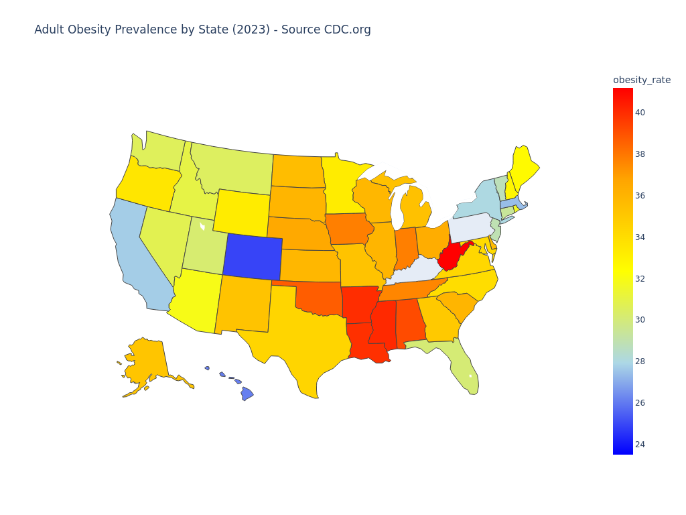
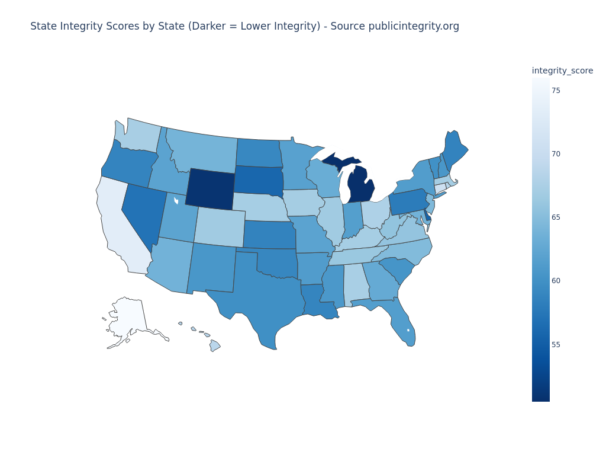
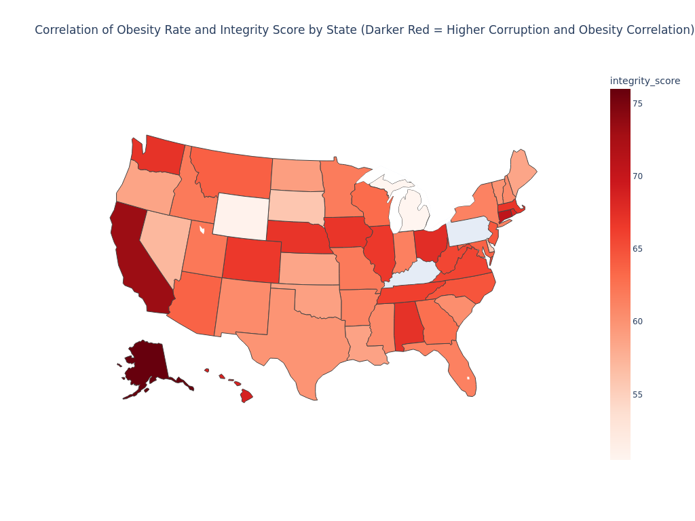

### README.md for GitHub

---

# State Obesity and Political Integrity Correlation Analysis

This Python script analyzes the correlation between state-level obesity rates (2023 CDC data) and political integrity scores (2015 data from the Center for Public Integrity). The goal is to investigate whether there is a statistical relationship between these two variables.





## Results

- **Correlation Coefficient**: -0.22
- **P-value**: 0.1416

The results show a weak negative correlation that is **not statistically significant** at the 95% confidence level (p > 0.05). This indicates that there is no meaningful association between obesity rates and political integrity scores by state.

## Data Sources

1. **Obesity Rates by State (2023)**: [Downloaded from the CDC's website.](https://www.cdc.gov/obesity/media/files/2024/09/2023-Obesity-by-state.csv)
2. **State Integrity Scores (2015)**: Retrieved from the (Center for Public Integrity's JSON data.)[https://cloudfront-files-1.publicintegrity.org/apps/2015/10/stateintegrity/0.1.35/data/overview.json]

## Analysis Overview

1. **Data Preparation**:
   - Loads and cleans data from both sources.
   - Maps state names to abbreviations for consistency.
   
2. **Visualization**:
   - Creates three choropleth maps:
     - Obesity rates by state.
     - Political integrity scores by state (darker color = lower integrity).
     - Combined map showing both metrics side-by-side for visual comparison.

3. **Correlation Analysis**:
   - Calculates the Pearson correlation coefficient between obesity rates and integrity scores.
   - Tests the significance of the correlation to determine if the relationship is statistically meaningful.


## Requirements

- `pandas` for data manipulation
- `plotly.express` for visualization
- `requests` for data downloading
- `scipy` for statistical analysis

## Usage

1. Clone the repository.
2. Install dependencies:
   ```bash
   pip install pandas plotly requests scipy
   ```
3. Run the script:
   ```bash
   python3 corrupt_and_obesity.py
   ```

The script will output the correlation coefficient, p-value, and whether the correlation is statistically significant. Additionally, it will display the generated maps for visual inspection.
